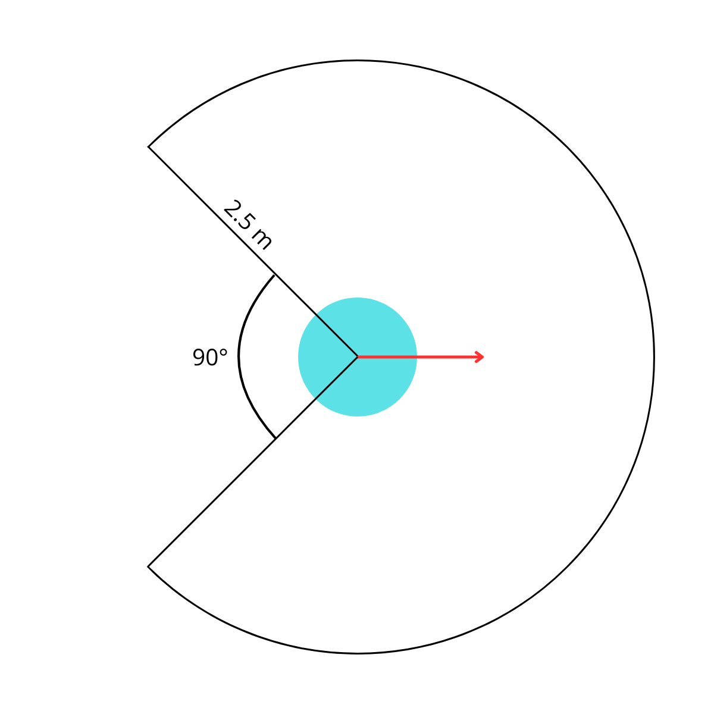
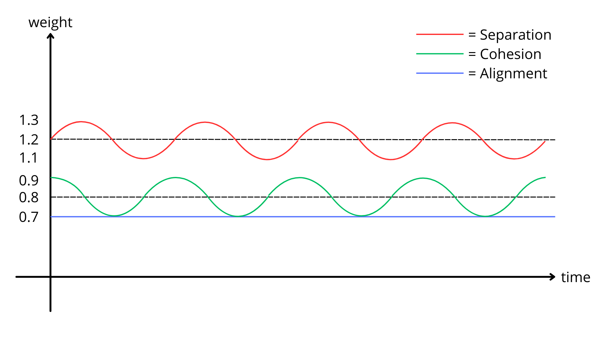
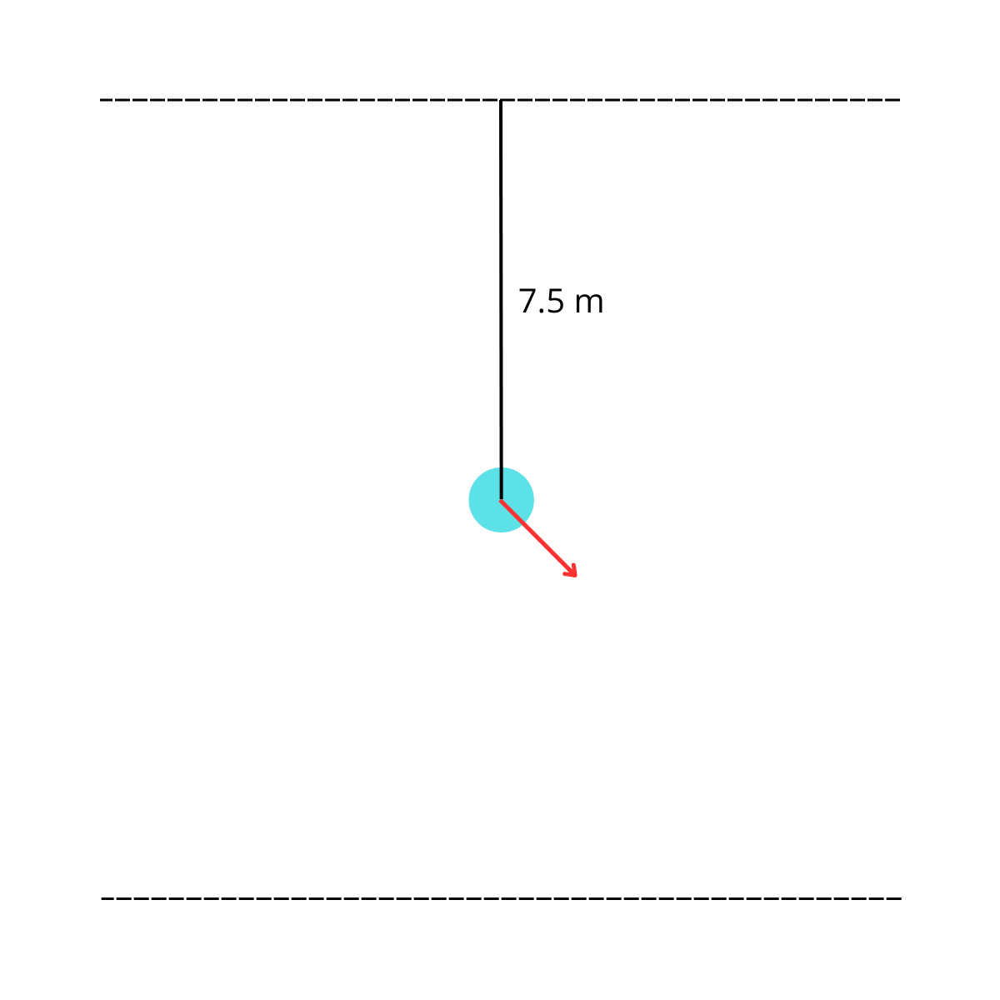
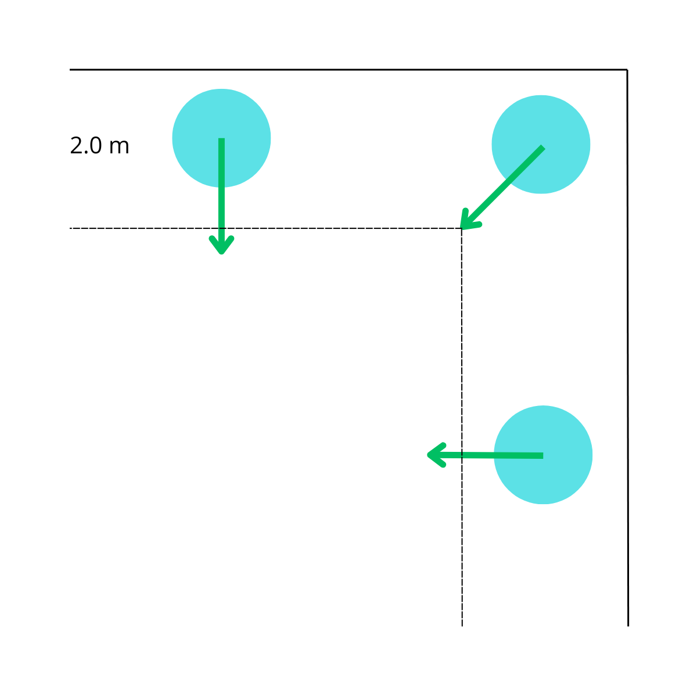

# **Chasing Flock**, <small>by Matteo Mangioni</small>

This document will explore the modelling process and implementation choices behind the "Chasing Flock" project created by Matteo Mangioni for the 2024/2025 edition of the *Artificial Intelligence for Video Games* course held by Prof. Maggiorini and Prof. Gadia at the University of Milan Statale.

## Problem

First of all, let's give a brief summary of the project's specifications.
The aim of the project is to simulate a **flock** of agents navigating a **2D world** to reach a series of targets while simultaneously avoiding moving obstacles and the world's edges.

More specifically, the world is defined as a $100 \times 100 \text{ m}$ square: inside it, $10$ to $30$ grey circular **obstacles** with a radius of $1 \text{ m}$ move horizontally at a random constant speed between $5$ and $20 \text{ m/s}$ without colliding with each other.
Moreover, at the start of the simulation a red circular **target** of radius $0.1 \text{ m}$ is placed randomly at a maximum distance of $10 \text{ m}$ from one of the world's corners: this is the target the agents will try to get to.
When reached by an agent, the target will move to a random position within $10 \text{ m}$ of a *different* random corner of the world.

The **flock** is to be composed of $50$ agents which will move at a constant speed of $10 \text{ m/s}$: we will refer to each individual agent as a **boid** from here on out.
These boids will need to follow the original flocking algorithm described by Craig Reynolds in *"Flocks, Herds, and Schools: A Distributed Behavioral Model"* (1987), which is explained later in this document, while simultaneously moving as a whole towards the ever-shifting target.
No size specifications where given for the boids, so a light-blue circle of $0.5 \text{ m}$ of radius was used: [Figure 1](#figure1) shows a comparison between the three shapes.

<a name="figure1"></a>

<figcaption>Figure 1 - Size comparison between boids, obstacles and the target.</figcaption>
<br>

## Model

This section describes the mathematical model that was used as the basis for the simulation, explaining the different choices that were made and the reasoning behind them.

The **boids** are certainly the most interesting and complex part of the simulation: how they move is the core of problem.
In accordance to the original approach by Craig Reynolds, the flock is built using a "**bottom-up**" philosophy: instead of having a group AI that manages the flock as a whole, **each individual boid is treated as a separate agent** and the flocking is an **emergent behaviour**.

As per the specification, each boid moves with a constant *linear speed* of $10 \text{ m/s}$: however, instead of simply moving towards where they need to go at full speed, each boid is also given an *angular speed* of $540 \text{ degrees/s}$ and needs to turn to face the wanted direction.
This means that instead of directly moving towards a given direction, **boids only move in the direction they're facing**: said direction is instead used to progressively turn the characters, thus affecting their trajectory while they continue to move straight ahead at full speed (see [Figure 2](#figure2)).
This technique greatly increases the realism and believability of the simulation by both disabling instantaneous turns and avoiding the "jittering" effect that comes from quickly oscillating between very similar movement directions.

<a name="figure2"></a>

<figcaption>Figure 2 - A turning boid: the current direction is in red while the desired direction is green.</figcaption>
<br>

Since this movement algorithm requires each boid to have a *desired direction* to turn towards, to complete the definition of the boid's behaviour we need a way to decide where they should go.
To do this, we employ a system based on **steering behaviours**: these are individual behaviours each with a different goal and each dictating a different direction at any given time.
These directions are then combined in some way to obtain the final vector to use for the boid's movement.

In particular, this project uses a priority system that combines both arbitration and blending.
It works by assigning each steering behaviour both a **priority** (*an integer*) and a **weight** (*any positive or zero number*): behaviours are then sorted into **groups** based on their priority.
When deciding where to go we start with the group with the highest priority, gather the *"proposed direction"* for each behaviour and blend them using their respective weights: then, if the obtained direction has a magnitude of at least $\epsilon = 0.1$ we use it; otherwise, we evaluate the group with the second highest priority, and so on.
This system has the benefit of both allowing different, individually simple behaviours to cooperate in order to create a complex movement algorithm while ensuring at the same time that some critical behaviours are immediately acted upon when needed without being diluted by the others.

In this project we use a total of **3 groups**, which are here reported from highest to lowest priority:

- (2) **Wall avoidance**, which only contains the [Wall Avoidance](#wall-avoidance) behaviour.
- (1) **Obstacle avoidance**, which only contains the [Obstacle Avoidance](#obstacle-avoidance) behaviour.
- (0) **Flocking and chasing**, which contains all three [Flocking](#flocking) behaviours as well as the [Chase](#chase) behaviour.

The behaviours in the first two groups both have a weight of $1$, which isn't really used since they're both alone in their group: instead, the weights of behaviours in the last group will be discussed in their respective sections.
Originally, the first two groups where condensed in one: this, however, rendered Wall avoidance less effective, meaning that when trying to avoid an obstacle near the edges the boid sometimes escaped the confines of the world, which was considered a less favourable result than briefly colliding with an obstacle.
That being said, the following sections explore and explain the different steering behaviours that make up the aforementioned groups.

### Flocking

Following the original approach by Craig Reynolds, the flocking behaviour is obtained by the combination of three different atomic behaviours: a [**Separation**](#separation) behaviour, a [**Cohesion**](#cohesion) behaviour and an [**Alignment**](#alignment) behaviour.
All of these rely on the concept of **boid neighbourhood**: the idea is that each boid will take decisions about its movement by observing only the boids near it instead of the whole flock.
Not only does this reduce the amount of computations needed for each boid but also improves realism by emulating *locality*, a property of real-world flocks.
In this project boids were given a circular neighbourhood of $2.5 \text{ m}$ of radius with a field of view of $270°$, as shown in [Figure 3](#figure3): the addition of this angular cutoff serves to increase believability by making boids ignore other agents that are directlyS behind them.
The radius was instead chosen to incorporate a good chunk of the flock but not its entirety and was partially related to the boids' speed of $10 \text{ m/s}$, with the objective of giving them the ability to react to boids within a few moments of distance.

<a name="figure3"></a>

<figcaption>Figure 3 - The neighbourhood of a boid: the red vector indicates the boid's current direction.</figcaption>
<br>

Usually a boid's neighbourhood contains the boid itself and its characteristics are used for the computations that we'll see in the following sections: however, in the project it was decided that *if a boid's neighbourhood contains only the boid itself, then it's considered empty* and flocking behaviours are disabled altogether.
The reasoning behind this choice was to incentivise lonely boids to reunite with the flock by disregarding Separation, Cohesion and Alignment with themselves and only following the Chase behaviour that, as we'll see, will point them towards the target: since the flock as a whole will also be moving there, this increases the chances of the boid being reabsorbed in it.

In order to further increase realism, the three behaviours were given **different and dynamic weights**.
First of all, Separation was given a higher base weight of $1.2$, followed by Cohesion at $0.8$ and finally Alignment at $0.7$: this disparity in weight was used to prioritize certain flocking components over others, creating a more believable behaviour.
Furthermore, Separation and Cohesion's weight were made to oscillate over time with the use of trigonometric functions: this was done to obtain alternating moments where the flock is either more or less compact based on the relative values of weights.
All in all, the following formulas describe the components' weights at any time $t$ (see [Figure 4](#figure4)):

$$\color{red}{\text{Separation}} = 1.2 + 0.1 \cdot \sin(t)$$
$$\color{green}{\text{Cohesion}} = 0.8 + 0.1 \cdot \cos(t)$$
$$\color{blue}{\text{Alignment}} = 0.7$$

<a name="figure4"></a>

<figcaption>Figure 4 - The weights of the flocking components over time, labeled by color.</figcaption>
<br>

#### Separation

The most highly weighted of the three components, the **Separation** behaviour works by trying to *distance the boid from all its neighbours* in order to avoid collisions.
For each neighbour it computes the vector from the neighbour's position to the boid's position, normalizes it and then scales it based on the distance between the two agents: the resulting vectors are then summed and the result is normalized to obtain the final desired direction.
If we declare $b_p$ to be our boid's position and $N_p$ the set of its neighbours' positions, we can use the following formula to compute the separation vector $\vec{s}$:

$$
\vec{s} = \sum_{n \in N_p}{\left(\frac{(b_p - n)}{\|\|b_p - n\|\|} \cdot \frac{1}{\|\|b_p - n\|\| + 0.0001}\right)}
$$

which is then normalized to obtain the final result. Using the distance to weigh the contribution of each neighbour makes it so that closer ones are given greater importance than distant ones, resulting in a more tight and stable flock.
Also note that a minimum increase of $0.0001$ is given to each distance in order to avoid numerical problems in the of vectors with norm $0$.

#### Cohesion

Somewhat opposite to Separation, the **Cohesion** component attempts to keep the flock compact by *moving boids towards the "center of mass" of their neighbourhood*, i.e. the mean of the positions of its neighbours.
This is done by computing said mean and subtracting the boid's position from the result, thus obtaining the vector that from the boid's current position points to the center of mass: this is normalized to obtain the desired direction.
If we declare $b_p$ to be our boid's position and $N_p$ the set of its neighbours' positions, we can use the following formula to compute the cohesion vector $\vec{c}$:

$$
\vec{c} = \left(\frac{1}{\|N_p\|}\sum_{n \in N_p}{n}\right) - b_p
$$

which is then normalized to obtain the final result.

#### Alignment

The final flocking component, the **Alignment** behaviour works by trying to make boids in a neighbourhood *face the same direction*: to do so, each boid tries to turn to the average facing direction of its neighbours, which is simply calculated as the sum of their current velocities and then normalized to obtain the desired turning direction.
If we declare $N_v$ to be the set of the boid's neighbours' facing directions, we can use the following formula to compute the alignment vector $\vec{a}$:

$$
\vec{a} = \sum_{\vec{n} \in N_v} \vec{n}
$$

which is then normalized to obtain the final result.
As we can see, here we aren't actually averaging the facing directions since we miss a division by $\|N_v\|$: however, that division isn't really needed since the result is then normalized, cancelling any effect it might have had.

### Chase

Let's now discuss the final behaviour in the lowest priority group, the **Chase** behaviour, which tries to *move boids towards the target*.
This is by far the simplest behaviour: given the target's position, the desired direction is the normalized vector from the boid's current position to the target's position.
If we declare $b_p$ to be the boid's position and $t_p$ the target's position we can use the following formula to obtain the chase vector $\vec{t}$:

$$
\vec{t} = t_p - b_p
$$

which is then normalized to obtain the final result.
No complex "arrive" algorithm that slows down the boids as they approach the target is needed here, since when reached the target will automatically teleport to another position that can immediately be chased next.

### Obstacle avoidance

The only component of the second highest priority group, the **Obstacle avoidance** behaviour is definitely the most complex.
Its task is to make sure that *boids don't collide with the moving obstacles* that populate the 2D world and that they escape as quickly as possible if they accidentally do.

First of all we need to decide which obstacles are considered by the boid, since at any specific time some obstacles will be so far that they don't have any real impact on the desired direction.
Originally the same field of view used for flocking was employed: however, this didn't work well especially with fast moving obstacles which wouldn't be detected until the very last moment.
Instead, each boid is given a **vertical range** of $7.5 \text{ m}$: it will consider all obstacles are within $7.5 \text{ m}$ of it vertically, regardless of the direction the boid or the obstacle are moving (see [Figure 5](#figure5)).
This significantly cuts down on the number of obstacles to consider, allowing for some performance optimization.

<a name="figure5"></a>

<figcaption>Figure 5 - A boid's vertical range.</figcaption>
<br>

Having narrowed the range of obstacles to consider, the algorithm then checks if the boid is currently colliding with any obstacle, i.e. the distance between their centers is less than $1.5 \text{ m}$: if this is the case, then no further obstacles are considered and the desired direction is the one that goes from the colliding obstacle's position to the boid's position, which is the faster route of escape.

$$
\text{If colliding with obstacle in position } o_p \text{   } \longrightarrow \text{   } \vec{d} = b_p - o_p
$$

If the boid isn't colliding with any obstacle then for each obstacle we compute the *time it would take for the obstacle and boid to collide if they were moving directly towards each other*: this is done by computing the current distance between the two objects and dividing it by their relative speed, which is obtained by subtracting the boid's velocity $b_v$ from the obstacle's velocity $o_v$ and extracting the norm of the resulting vector (*to which we add a flat $0.0001$ to avoid potential problems with zero relative speeds*).
If we call $b_p$ and $o_p$ the positions respectively of the boid and the obstacle, and $t_{bo}$ the **"time to crash"** we're looking for we can write:

$$
t_{bo} = \frac{\|\|o_p - b_p\|\|}{\left|\left|\vec{o}_v - \vec{b}_v\right|\right| + 0.0001}
$$

This value is then used to predict where the obstacle and boid will *actually* be in said time assuming that they keep their current velocity, which they probably will in the short term.
In case of slow moving obstacles or other particular cases, however, this time to crash could be too much into the future, breaking our assumption about maintaining velocity: that is why we put an *upper bound on the "time to crash"* of $3 \text{ s}$, meaning that if the value exceeds $3 \text{ s}$ we use this bound instead.
So if we call $b_f$ and $o_f$ the predicted future positions of the boid and obstacle respectively we can write:

$$t_{bo} = \min{}\left[\frac{\|\|o_p - b_p\|\|}{\left|\left|\vec{o}_v - \vec{b}_v\right|\right| + 0.0001}, \quad 3 \right]$$

$$b_f = b_p + \vec{b_v} \cdot t_{bo}$$

$$o_f = o_p + \vec{o_v} \cdot t_{bo}$$

We then check if these two positions are within $2.5 \text{ m}$ of each other, which accounting for the object's radii means that there is at least $1 \text{ m}$ of free space between them: if there is, we can ignore the obstacle as even if we were moving straight towards it we would miss it; otherwise, we add the obstacle to a list of potential collisions to avoid.
When all obstacles have been evaluated this way, we pick the one with the **smallest "time to crash"** value to actively avoid: we have to pick only one since blending between the avoidance of multiple obstacles doesn't work well in practice and it is better to avoid one obstacle at a time.
So finally, to get the avoidance direction $\vec{o}$ we simply normalize the vector starting from the *obstacle's future position* and ending on the *boid's future position*: instead of avoiding where the obstacle is now, we plan in advance and avoid its future position.
In formula:

$$\vec{o} = b_f - o_f$$

with the usual normalization.
In actuality, however, the formulas above need a little more care when predicting the obstacles' future positions to account for the fact that they move back and forth horizontally and therefore invert their velocity when they reach the world's edges.
To do this, we can simply check if the predicted future position exceeds the world's bounds and adjust it if it does.

### Wall avoidance

The behaviour with the highest priority, **Wall avoidance** is very simple: when a boid is within $2 \text{ m}$ of any of the world's edges, a desired direction is computed in the opposite direction from the edge.
In the occasion that the boid is within $2 \text{ m}$ of two edges, which only happens in corners, the individual directions for each wall are summed to obtain a diagonal one as shown in [Figure 6](#figure6).
Originally a more complicated system was intended for these situations around corners, one which handled scaling the contributions based on the boid's distance from that wall: ultimately, however, the improvement was too little to justify the increased computation time.

<a name="figure6"></a>

<figcaption>Figure 6 - The directions suggested by wall avoidance in different situations.</figcaption>
<br>

## Implementation

In this section we explore the interesting implementation details of the project, explaining the different choices that were made to turn the model described until now into a computer simulation.
Instead of analyzing every script, however, we will skip the $1:1$ implementations of the algorithms described before to give a more high-level view of the structure of the whole program.

The project was developed using **Unity 2022.3.48f1**, a freely available game engine that is intended for both 2D and 3D video games: our case is admittedly bidimensional, so a complete 2D approach was used.
Therefore, the world is represented by a $100 \times 100 \text{ m}$ flat plane centered in the origin: this meant that the obstacles' and boids' positions were constrained in the $[-50, 50]$ range both horizontally and vertically, a useful symmetry which allowed for some small optimizations in the code.
It also meant that both obstacles and boids move only on the $x$ and $y$ axes: in particular, a **boid's current direction is its local $\bf y$ axis** (accessible in the code as `transform.up`) instead of the $z$ axis commonly used as *"forward"* in many 3D games.

Three main entities populate the simulation: **boids**, **obstacles** and the **target**.
The latter is the only one that is present in the scene before startup, while the other two are saved as prefabs and are spawned at the beginning of the simulation by their respective manager scripts (see [Managers](#managers)).
All these entities are given a `CircleCollider2D` to mark their shape, but in order to easily differentiate among them they are placed on **different physics layers**: a *Target* layer for the target, an *Obstacles* layer for the obstacles and a *Boids* layer for the boids.
The Target is the only object to also be given a `Rigidbody2D`: this is set to Kinematic mode and is only used to easily detect when a boid has reached the target.

### Controllers

All moving entities, i.e. boids, obstacles and the target, are given a controller behaviour that actually performs the movement by gradually changing their position across frames.
There isn't any inheritance relationship between these classes as they need to do very different things, but among the common denominators we can find that the dynamic change of the object's position is done inside the `FixedUpdate` method, as its (*almost*) fixed rate of execution helps smooth out the movement.
That being said, let's see each of them separately.

#### Obstacle Controller

The `ObstacleController` is by far the simplest one.
It works by progressively updating the obstacle's position using the `Speed` value it was given when the object was created: at each call of the `FixedUpdate` function this value is multiplied by `Time.fixedDeltaTime` and added to the current $x$ coordinate of the obstacle to obtain a possible new $x$ coordinate.
Before assigning this value to the transform, however, we check if it exceeds the world bounds: since the obstacles have a radius of $1$ unit, this means that we check if its absolute value is greater than $50 - 1 = 49$.
If it is, we adjust the future position by mirroring it over the exceeded edge and *invert the sign of the `Speed` attribute* to start moving in the opposite direction.

```c#
private void FixedUpdate() {
	float newX = transform.position.x + Speed * Time.fixedDeltaTime;
	if (Mathf.Abs(newX) > 49f) {
		Speed = -Speed;
		newX = 2 * transform.position.x - newX;
	}
	transform.position = new Vector3(newX, transform.position.y, 0f);
}
```

#### Target Controller

While the target doesn't move dynamically during the execution, it needs some logic for how to teleport on a *different* random corner when it's reached by a boid.
To do so it uses a `PlaceInRandomCorner()` private method that is called both at startup and when a collision is detected with an object whose physics layer is part of the LayerMask stored in the serialized `_layerMask` field: by default this only contains the *Boids* layer.

`PlaceInRandomCorner()` works by repeatedly extracting a random point inside a unit circle with the `Random.insideUnitCircle` method and computing its **corner code**: this is a simple enum-like value that is used to identify each of the four quarters of the 2D space.
It is calculated by the `CornerCode()` private method which, given a 2D vector, computes a unique value based on which quarter it falls in by means of dot products with the standard `Vector2.right` and `Vector2.up` versors.
The obtained corner code is then confronted with the `_lastCornerCode` private attribute to make sure that another corner of the world has been chosen: that is because each quarter of the 2D space is associated with a corner of the world based on which quarter the world itself would reside in if the origin of the 2D space was moved in the corner in question.
This results in the following associations:

- `0` =  1st quarter $\rightarrow$ bottom-left corner
- `1` =  2nd quarter $\rightarrow$ bottom-right corner
- `2` =  4th quarter $\rightarrow$ top-right corner
- `3` =  3rd quarter $\rightarrow$ top-left corner

The `_lastCornerCode` value is initialized as $-1$ to indicate that no corner has been chosen already and is assigned after a new corner is found.
When this happens, the target is moved to the random position indicated by the same 2D vector obtained by `Random.insideUnitCircle` multiplied by $10$, to which the selected corner's coordinates are added.

#### Boid Controller

The `BoidController` behaviour is in charge of gathering all steering behaviour assigned to the boid, sort them in priority groups and periodically compute the new direction towards which to move.

At startup the controller gathers all `SteeringBehaviour` components attached to the object and sorts them in *descending order of priority*.
It then initializes the `_steeringGroups` private list of `SteeringGroup` objects, a struct type that contains:

- `Priority`, an integer;
- `Behaviours`, a list of `SteeringBehaviour`;

This `_steeringGroups` list is then initialized by running through the sorted list of SteeringBehaviours and creating a new group each time a new priority value is found: this way, the `_steeringGroups` are already sorted in descending order of priority.

As its last step during startup, the controller launches the `ComputeDirection()` coroutine: this is the routine that actually executes the movement algorithm described in the [Model](#model) section by adding up all direction proposals by the steering behaviours in a group, confronting them with the epsilon value and eventually continuing to the next group.
Moreover, this method also performs the two *perception* tasks of gathering the neighbouring boids and obstacles that the different steering behaviours will need to take into consideration: in the boids case the neighbours are obtained by using `Physics2D.OverlapCircleNonAlloc()` to get all boids within FOV range and then applying the FOV cutoff in the `FilterBoidsByFOV()` method, which works by employing the fact that the dot product between two vectors is equal to the cosine of the angle between them.
As we can see these are quite expensive operations, which is why this whole process isn't executed at each frame: instead, it is launched every $0.05$ seconds, significantly improving performance while maintaining the correct amount of reactivity.

What is executed each frame is instead the `FixedUpdate()` function, which works by slowly updating the boid's rotation using its angular speed and then moving at full speed towards the facing direction.

### Steering Behaviours

Steering behaviours are treated as individual MonoBehaviour scripts to be attached to each boid and contribute to movement by being called by the `BoidController`.
They therefore have the need to be treated uniformly, which is why they're organized in the hierarchy shown in [Figure 7](#figure7) where the abstract `SteeringBehaviour` class is the base for all other behaviour classes which only implement its abstract methods.
In particular, each steering behaviour has:

- A public `Priority`  attribute, used for sorting into groups;
- A protected `Init()` method used to setup the behaviours' internal structures and parameters which is called by the base `Awake()` method;
- A public `GetDirection(Collider2D[] colliders, int size)` method which takes an array of `Collider2D` and its integer size to compute the suggested direction *already multiplied by the behaviour's weight*.
	This last bit is necessary since as we'll see the behaviour weights are all stored inside a singleton behaviour, so only the class itself knows which weight to use.

<a name="figure7"></a>

<figcaption>Figure 7 - The SteeringBehaviour hierarchy of classes.</figcaption>
<br>

Notice how the `BoidComponent` abstract class is completely empty: as a matter of fact it is only used to categorize the flocking behaviours in order for the `BoidController` to decide to which behaviours it needs to pass the colliders of the boid's neighbours.

### Managers

The only interesting things left to discuss are a few GameObjects which act as managers for specific parts of the simulation: most of these are realized using the Singleton pattern to grant easy access to their parameters from other classes.

First of all we have the `ObstacleSpawner` and the `BoidSpawner` which, as can be imagined, are tasked with spawning obstacles and boids respectively at startup.
While the latter only extracts random positions inside a unit circle of given radius and instantiates boids there, the former is a little bit more sophisticated: it works by successively extracting random values for the obstacle's height and checking that it won't collide with any other obstacle by looking for previously extracted $y$ coordinates within $2 \text{ m}$ of the extracted value.
It also saves the instantiated obstacles' `Collider2D` in a list ordered by $y$ coordinate so that it can quickly return the obstacles inside the vertical range of a boid with the `GetObstaclesAroundHeight()` public method.
Moreover, each collider is also associated with its `ObstacleController` instance inside a public `Controllers` dictionary so that boids can easily access the obstacles' velocity vectors without need for an expensive `GetComponent` invocation.

The other major manager script is the `BoidShared` singleton, which contains all parameters for the boid's steering behaviours, from their weights to specific attributes like the avoidance distance of the wall and obstacle avoidance and even the `Epsilon` value used by the BoidControllers to check against the norm of a steering group's total direction.
