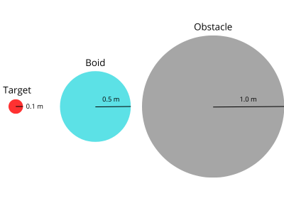
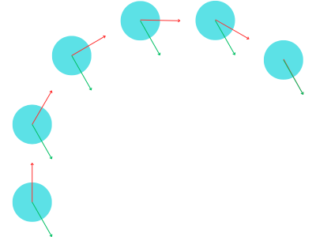

# **Chasing Flock**, <small>by Matteo Mangioni</small>

This document will explore the modelling process and implementation choices behind the "Chasing Flock" project created by Matteo Mangioni for the 2024/2025 edition of the *Artificial Intelligence for Video Games* course held by Prof. Maggiorini and Prof. Gadia at the University of Milan Statale.

## Problem

First of all, let's give a brief summary of the project's specifications.
The aim of the project is to simulate a **flock** of agents navigating a **2D world** to reach a series of targets while simultaneously avoiding moving obstacles and the world's edges.

More specifically, the world is defined as a $100 \times 100 \text{ m}$ square: inside it, $10$ to $30$ grey circular **obstacles** with a radius of $1 \text{ m}$ move horizontally at a random constant speed between $5$ and $20 \text{ m/s}$ without colliding with each other.
Moreover, at the start of the simulation a red circular **target** of radius $0.1 \text{ m}$ is placed randomly at a maximum distance of $10 \text{ m}$ from one of the world's corners: this is the target the agents will try to get to.
When reached by an agent, the target will move to a random position within $10 \text{ m}$ of a *different* random corner of the world.

The **flock** is to be composed of $50$ agents which will move at a constant speed of $10 \text{ m/s}$: we will refer to each individual agent as a **boid** from here on out.
These boids will need to follow the original flocking algorithm described by Craig Reynolds in *"Flocks, Herds, and Schools: A Distributed Behavioral Model"* (1987), which is explained later in this document, while simultaneously moving as a whole towards the ever-shifting target.
No size specifications where given for the boids, so a light-blue circle of $0.5 \text{ m}$ of radius was used: [Figure 1](#figure1) shows a comparison between the three shapes.

<figure>
	
	
	<figcaption>Figure 1 - Size comparison between boids, obstacles and the target.</figcaption>
</figure>

## Model

This section describes the mathematical model that was used as the basis for the simulation, explaining the different choices that were made and the reasoning behind them.

### Boids

The **boids** are certainly the most interesting and complex part of the simulation: how they move is the core of problem.
In accordance to the original approach by Craig Reynolds, the flock is built using a "**bottom-up**" philosophy: instead of having a group AI that manages the flock as a whole, **each individual boid is treated as a separate agent** and the flocking is an **emergent behaviour**.

As per the specification, each boid moves with a constant *linear speed* of $10 \text{ m/s}$: however, instead of simply moving towards where they need to go at full speed, each boid is also given an *angular speed* of $540 \text{ degrees/s}$ and needs to turn to face the wanted direction.
This means that instead of directly moving towards a given direction, **boids only move in the direction they're facing**: said direction is instead used to progressively turn the characters, thus affecting their trajectory while they continue to move straight ahead at full speed (see [Figure 2](#figure2)).
This technique greatly increases the realism and believability of the simulation by both disabling instantaneous turns and avoiding the "jittering" effect that comes from quickly oscillating between very similar movement directions.

<figure>
	
	
	<figcaption>Figure 2 - A turning boid: the current direction is in red while the desired direction is green.</figcaption>
</figure>

Since this movement algorithm requires each boid to have a *desired direction* to turn towards, to complete the definition of the boid's behaviour we need a way to decide where they should go.
To do this, we employ a system based on **steering behaviours**: these are individual behaviours each with a different goal and each dictating a different direction at any given time.
These directions are then combined in some way to obtain the final vector to use for the boid's movement.

In particular, this project uses a priority system that combines both arbitration and blending.
It works by assigning each steering behaviour both a **priority** (*an integer*) and a **weight** (*any positive or zero number*): behaviours are then sorted into **groups** based on their priority.
When deciding where to go we start with the group with the highest priority, gather the *"proposed direction"* for each behaviour and blend them using their respective weights: then, if the obtained direction has a magnitude of at least $\epsilon = 0.1$ we use it; otherwise, we evaluate the group with the second highest priority, and so on.
This system has the benefit of both allowing different, individually simple behaviours to cooperate in order to create a complex movement algorithm while ensuring at the same time that some critical behaviours are immediately acted upon when needed without being diluted by the others.

In this project we use a total of **3 groups**, which are here reported from highest to lowest priority:

- (2) **Wall avoidance**, which only contains the [Wall Avoidance](#wall-avoidance) behaviour.
- (1) **Obstacle avoidance**, which only contains the [Obstacle Avoidance](#obstacle-avoidance) behaviour.
- (0) **Flocking and chasing**, which contains all three [Flocking](#flocking) behaviours as well as the [Chase](#chase) behaviour.

The behaviours in the first two groups both have a weight of $1$, which isn't really used since they're both alone in their group: instead, the weights of behaviours in the last group will be discussed in their respective sections.
Originally, the first two groups where condensed in one: this, however, meant that the Wall avoidance direction, which as we'll see will be null most of the time, skewed the Obstacle avoidance result, making it less effective.
The following sections explore and explain the different steering behaviours that make up the aforementioned groups.

#### Flocking

#### Chase

#### Wall avoidance

#### Obstacle avoidance

### Obstacles

### Target

## Implementation

### Controllers

### Steering Behaviours

### Managers

#### Obstacle Spawner

#### Boid Shared

#### Stats Manager

## Results

### Known problems

### Possible improvements
